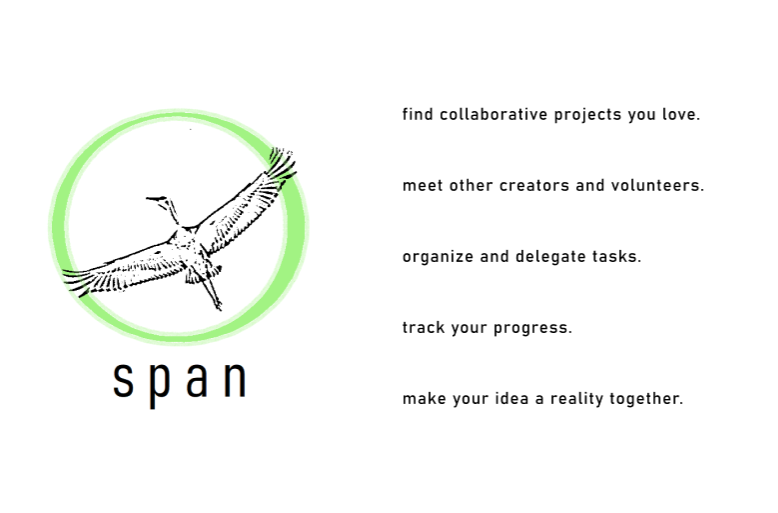

# Span
## a team matcher and organizer for volunteer and creative projects

Spring is a time for change. It is a time for new projects. For self-discovery. For planting seeds for others.

And despite the global COVID-19 crisis causing massive shutdowns and quarantining, we are springing forward like never before. Springing into public health projects and mutual aid groups but also creative writing collaborations and Zoom bands and [sourdough bread making](https://www.stanforddaily.com/2020/04/08/sourdough-nt-you-worry-how-to-bake-the-most-of-shelter-in-place/).

However, it is now especially **difficult to initiate or find teams for these projects**. Slack doesn't have recruiting options, Facebook is Facebook, and the last carrier pigeon Martha died at the Cincinnati Zoo in 1914. That’s why we launched [Span](https://docs.google.com/document/d/1Ubngkv0Yc_x3egMmQEVoorv59wuIXjuftLFkarryuVw/edit?usp=sharing), think of it as a nonstop remote hackathon for service and creative projects.

**With Span, it will be easy to start your own collaboration by submitting a project idea ― users from around the world can then join a team for your idea.** 

You can use Span to **delegate tasks** (using a system developed by the volunteer organization [Reach4Help](http://reach4help.org/), a branch of [Helpful Engineering](https://www.helpfulengineering.org/)), **check in with team members and volunteer advisers, and track milestones as the project progresses**.
 

It's also easy to take part in an existing project: just **submit a list of skills and interests, and Span will show you a list of recommended projects**. Ultimately, we hope Span becomes a positive network of projects where anyone can find a place to contribute their skills and discover lasting friendships. 

We are currently building and piloting the platform with Helpful Engineering, a group of 16K+ volunteers around the world to encourage more artistic projects in conjunction with engineering in the community. The project is led by Katie Fo and Shayan Chowdhury, with web development help from [Shein Lin Phyo](https://github.com/Penguinlay/). We're also currently onboarding projects and talent from Stanford University. 

Start or join projects [here](https://docs.google.com/forms/d/e/1FAIpQLSf_Hu6VqczEkODq3EPuB4eMyibtIDn7CsySrQHOze6uNjVl9Q/viewform) or read our launch letter [here](https://docs.google.com/document/d/1Ubngkv0Yc_x3egMmQEVoorv59wuIXjuftLFkarryuVw/edit?usp=sharing).

##[SIGN UP HERE IF INTERESTED!]()

We encourage you to share this message with friends, family, friends at universities, and anyone interested in mutual aid and quarantine projects. If you have a question, concern, or uplifting video of celebrities singing John Lennon tunes, please email us at span.teams@gmail.com.
